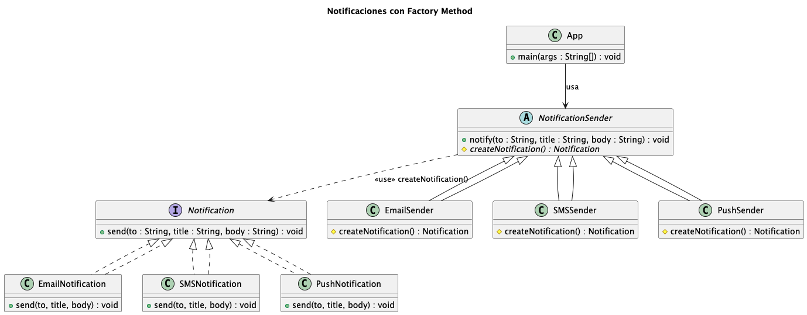
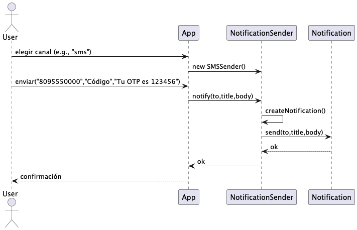

# Ejercicio: Sistema de Notificaciones con Factory Method

Este ejercicio implementa un sistema de **notificaciones multiplataforma** (Email, SMS, Push) utilizando el **patrón
Factory Method**.  
El objetivo es que el cliente **no conozca las clases concretas** de notificación, sino que trabaje solo con *
*interfaces y abstracciones**, favoreciendo **bajo acoplamiento** y **extensibilidad**.

---

## 🎯 Objetivos

- Implementar **EmailNotification**, **SMSNotification** y **PushNotification** como productos concretos.
- Usar un **Factory Method** para crear los productos sin exponerlos al cliente.
- Permitir **agregar nuevos canales** (ej. WhatsApp) sin modificar el cliente.
- Aplicar principios **SOLID**, especialmente:
    - **OCP (Open/Closed Principle)**: el sistema está abierto a extensión, cerrado a modificación.
    - **DIP (Dependency Inversion Principle)**: el cliente depende de abstracciones.

---

### Requerimientos funcionales

* Soportar envío de notificaciones por **Email**, **SMS** y **Push**.
* El cliente debe poder elegir el **canal** (p. ej., por configuración o argumento de ejecución).
* Todas las notificaciones deben exponer un método común, por ejemplo:
    * `send(to, title, body)` (o `send(NotificationRequest)` si prefieres agrupar datos).
* Debe ser fácil **agregar** un nuevo canal (ej.: **WhatsApp**) **sin tocar el cliente** (Open/Closed).

### Requerimientos no funcionales

* **Bajo acoplamiento**: el cliente depende de interfaces, no de clases concretas.
* **Extensibilidad**: nuevas subclases añaden nuevos productos (canales).
* **Claridad de diseño**: usar **UML** para comunicar y validar la arquitectura (diagrama de clases y secuencia).

## 📐 Diseño UML

### Diagrama de clases



#### Qué representa (lectura guiada):

* `Notification` es la **interfaz de producto** (contrato común). Sus implementaciones **realizan** la interfaz.
* `NotificationSender` es el **Creador** (superclase) que declara el **Factory Method** `createNotification()` y
  contiene la lógica
  **común** `notify()` que usa el producto.
* `EmailSender`, `SMSSender`, `PushSender` **heredan** del Creador y deciden qué **producto** concreto instanciar. (
  Herencia/generalización).
* El **cliente** (`App`) solo conoce la **superclase** `NotificationSender` (no las concretas).

> Tip UML: “Realización/Implementación” = una clase implementa una interfaz; “Generalización/Herencia” = subclase
> extiende superclase.

### Diagrama de secuencia



---

## 🧩 Implementación en Java (esqueleto mínimo)

### Producto e implementaciones

```java
public interface Notification {
    void send(String to, String title, String body);
}

public class EmailNotification implements Notification {
    @Override
    public void send(String to, String title, String body) {
        System.out.printf("[EMAIL] to=%s | %s - %s%n", to, title, body);
    }
}

public class SMSNotification implements Notification {
    @Override
    public void send(String to, String title, String body) {
        System.out.printf("[SMS] to=%s | %s - %s%n", to, title, body);
    }
}

public class PushNotification implements Notification {
    @Override
    public void send(String to, String title, String body) {
        System.out.printf("[PUSH] to=%s | %s - %s%n", to, title, body);
    }
}
```

### Creador y creadores concretos

```java
public abstract class NotificationSender {
    public final void notify(String to, String title, String body) {
        if (to == null || to.isBlank()) {
            throw new IllegalArgumentException("Destino vacío");
        }
        Notification n = createNotification();
        n.send(to, title, body);
    }

    protected abstract Notification createNotification();
}

public class EmailSender extends NotificationSender {
    @Override
    protected Notification createNotification() {
        return new EmailNotification();
    }
}

public class SMSSender extends NotificationSender {
    @Override
    protected Notification createNotification() {
        return new SMSNotification();
    }
}

public class PushSender extends NotificationSender {
    @Override
    protected Notification createNotification() {
        return new PushNotification();
    }
}
```

### Cliente

```java
public class App {
    public static void main(String[] args) {
        String channel = (args.length > 0) ? args[0] : System.getProperty("channel", "email");

        NotificationSender sender = switch (channel.toLowerCase()) {
            case "sms" -> new SMSSender();
            case "push" -> new PushSender();
            case "email" -> new EmailSender();
            default -> throw new IllegalArgumentException("Canal no soportado: " + channel);
        };

        sender.notify("8095550000", "Código", "Tu OTP es 123456");
        sender.notify("user@empresa.com", "Bienvenida", "¡Gracias por registrarte!");
    }
}
```

> **Nota didáctica**: Ese `switch` en la inicialización no “rompe” el patrón; el Factory Method vive en la jerarquía
> `NotificationSender`. El cliente solo decide qué creador concreto usar una vez (según el entorno), y a partir de ahí
> trabaja contra la superclase —tal como aconseja el material de Factory Method.

---

## ✅ Checklist de aceptación

- [x] **UML de clases** incluidos.
- [x] `Notification` es interfaz, con implementaciones concretas.
- [x] `NotificationSender` contiene el Factory Method.
- [x] **Tres creadores concretos** (`EmailSender`, `SMSSender`, `PushSender`).
- [x] Cliente **no conoce clases concretas de Notification**.
- [x] Es posible agregar un nuevo canal sin modificar el cliente.

---

## 🧪 Pruebas mínimas

1. **Email:** `java App email` → salida `[EMAIL] ...`
2. **SMS:** `java App sms` → salida `[SMS] ...`
3. **Push:** `java App push` → salida `[PUSH] ...`
4. **Extensión:** implementar `WhatsAppSender` y `WhatsAppNotification`, comprobar que el cliente no cambia.

---

## ⚡ Extensiones sugeridas

- Usar **Builder** para payloads complejos (asunto, adjuntos).
- Usar **Prototype** para clonar plantillas de mensajes.
- Usar **Abstract Factory** si manejas familias completas de productos (ej. proveedor A vs proveedor B).

---

## 🚫 Errores comunes

- **Confundir Factory Method con Simple Factory:** en FM el método está en la **superclase** y las
  **subclases deciden**.
- **Acoplar el cliente a implementaciones concretas:** el cliente nunca debería llamar `new EmailNotification()`.
- **Romper OCP:** no editar el cliente para cada nuevo canal, solo crear una nueva subclase.

---

## 📂 Entregables

- Código Java (`src/`).
- `README.md` (este documento).
- Diagramas PlantUML (`class-notifications.puml`).

---
